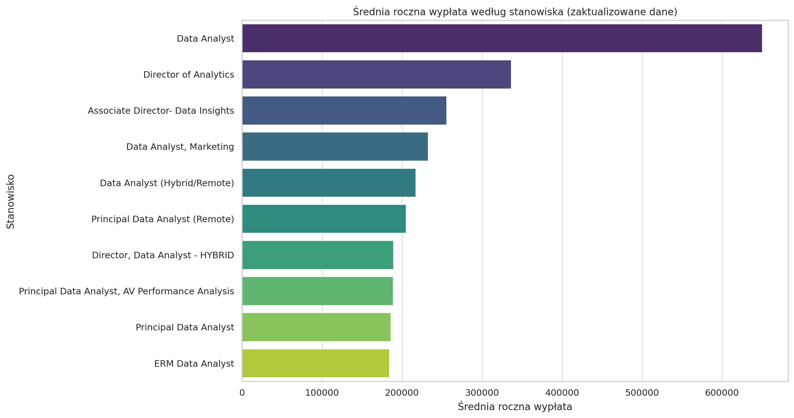
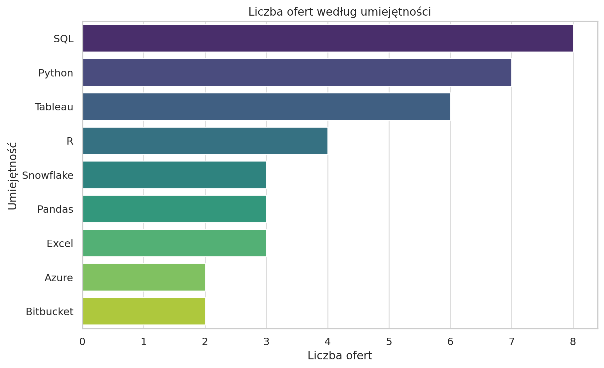

# Introduction
Are you intrested in data analysis? 👨‍💻 📊 Wanna explore data job’s market?

This project gives insight about it! 🔥 I analyzed market for most indemand skills,

most paying skills and high paying jobs 💰💸 Project mailny focuses on data analyst role

If you are intrested in SQL queries you can check them here [project_sql folder](/project_sql/)

# Background
My name is Maciej and I aspire to become data analyst. If you are like me, you can definetely check this project! This project was born to find optimal skills to learn (both in demand and high-paying), and find high paying jobs.

## For this we need to answer several questions:

1. What are top-paying jobs for my role?
2. What are skills required for these jobs?
3. What are the most in-demand skills for my role?
4. What are top skills based on salary for my role?
5. What are the optimal skills to learn? (both high demand and high paying)

# Tools I Used:

- **SQL**: Main tool for my analysis, that allowed me to query the database
- **VS Code**: My go-to environment for managing databases and executing queries
- **PostgreSQL**: Chosen database management system
- **Git and GitHub**: Way to share my work 

# The Anaysis

Each query aims at answering different question,
to get insight from different aspects of data market

### 1. Top Paying Jobs
In order to identify top paying jobs I filtered jobs by average yearly salary (excluding jobs with no given salary). Jobs are selected for remote data analyst role 
 ```sql
 Select 
    job_id,
    job_title,
    job_location,
    job_schedule_type,
    salary_year_avg,
    job_posted_date,
    company_dim.name
from
    job_postings_fact
left join company_dim on job_postings_fact.company_id = company_dim.company_id
where
    job_title_short like 'Data Analyst' and
     job_location = 'Anywhere' and
     salary_year_avg is not null
order by 
    salary_year_avg desc
limit 10
```
### 2. Top Paying Job Skill

To find skills associated with top paying jobs I used previous query as CTE and appended it with tables containing skills 

```sql
with top_paying_jobs as (
    Select 
        job_id,
        job_title,
        salary_year_avg,
        company_dim.name
    from
        job_postings_fact
    left join company_dim on job_postings_fact.company_id = company_dim.company_id
    where
        job_title_short like 'Data Analyst' and
        job_location = 'Anywhere' and
        salary_year_avg is not null
    order by 
        salary_year_avg desc
    limit 10)

select 
    top_paying_jobs.*,
    skills
 from top_paying_jobs
inner join skills_job_dim on top_paying_jobs.job_id = skills_job_dim.job_id
inner join skills_dim on skills_dim.skill_id = skills_job_dim.skill_id 
order by
    salary_year_avg desc
```
### 3. Top Demanded Skills 

In order to find top demanded skills I appended table job_postings_fact with table containing skill and grouped it by skill 
```sql 
with top_paying_jobs as (
    Select 
        job_id,
        job_title,
        salary_year_avg,
        company_dim.name
    from
        job_postings_fact
    left join company_dim on job_postings_fact.company_id = company_dim.company_id
    where
        job_title_short like 'Data Analyst' and
        job_location = 'Anywhere' and
        salary_year_avg is not null
    order by 
        salary_year_avg desc
    limit 10)

select 
    top_paying_jobs.*,
    skills
 from top_paying_jobs
inner join skills_job_dim on top_paying_jobs.job_id = skills_job_dim.job_id
inner join skills_dim on skills_dim.skill_id = skills_job_dim.skill_id 
order by
    salary_year_avg desc
```

### 4. Top Skills Based On Salary 

I appended job_posting_fact with table containing skills, found average salary and grouped it by skills
```sql
select 
    skills,
    round(avg(salary_year_avg),0) as avg_salary
from job_postings_fact
inner join skills_job_dim on job_postings_fact.job_id = skills_job_dim.job_id
inner join skills_dim on skills_dim.skill_id = skills_job_dim.skill_id 
where
    job_title_short like 'Data Analyst' and
    salary_year_avg is not null and
    job_work_from_home = True
group by
    skills
order by 
    avg_salary desc
LIMIT 30
```

### 5. Most Optimal Skills

In order to do this I needed to combine previous two questions, so demand for job and average payment assosiated with it. Since highest payment is usually connected with very rare skills and highest demand is tied to average paying skills we need to find sweet spot. Because of that I decided to find highest paying skills that occur at least 20 times in job postings

```sql
Select
    skills_dim.skill_id,
    skills_dim.skills,
    Count(skills_job_dim.job_id) as demand_count,
    round(avg(job_postings_fact.salary_year_avg), 0) as avg_salary
from job_postings_fact
inner join skills_job_dim on job_postings_fact.job_id = skills_job_dim.job_id
inner join skills_dim on skills_dim.skill_id = skills_job_dim.skill_id 
where 
    job_title_short = 'Data Analyst' and
    salary_year_avg is not null and
    job_work_from_home = True 
group by
    skills_dim.skill_id
having
    count(skills_job_dim.job_id) > 20
order by 
    avg_salary desc
limit 25
```

# Results

These are top 10 highest paying roles, which shows us highest salaries we can achieve as data analyst.



Second graph shows us most commonly required skills for highest paying jobs, which gives us information, that in order to be able to apply for these jobs we need to know programming languages as **SQL**, **Python** and **R**, something to display data: **Tableau** and cloud tools as **Snowflake**, **Azure** and **Bitbucket**



Top demanded skills for data analyst are: 

| Skills | Demand Count |
|--------|--------------|
|SQL     |92628         |
|Excel   |67031         |
|Python  |57326         |
|Tableau |46554         |
|Power BI|39468         |

Which gives as pretty much the same skills as for highest paying roles, but excel is required way more often and for displaying data along **Tableau** we get also **Power BI**

As for highest paying skills: 

| Skills  | Average Salary |
|---------|----------------|
|Pyspark  |208172          |
|Bitbucket|189155          |
|Watson   |160515          |
|Couchbase|160515          |
|Datarobot|155486          |
|Gitlab   |154500          |
|Swift    |153750          |
|Jupiter  |152777          |
|Pandas   |151821          |
|Golang   |145000          |

We can see that most paying skills are related to:

- Programing languages: **Golang**, **Swift** or **Python (Pandas)**
- Big data and machine learning skils: **Datarobot**, **Watson**, **Couchbase** and **Pyspark**

Last but not least: 

|nr| Skills  | Average Salary | Demand Count |
|--|---------|----------------|--------------|
| 1|Go       |115320          |27            |
| 2|Hadoop   |113191          |22            |
| 3|Snowflake|112948          |37            |
| 4|Azure    |111225          |34            |
| 5|AWS      |108317          |32            |
| 6|Oracle   |104534          |37            |
| 7|Looker   |103795          |49            |
| 8|Python   |101397          |236           |
| 9|R        |100499          |148           |
|10|Tableau  |99288           |230           |
|15|SQL      |97237           |398           |

As we can see most optimal skills are cloud tools and specifically cloud-base databases
We also have programming languages such as **python** and **r** in top 10. 15th is **SQL** which is added in this table because of very high demand count

# What I learned

- **Writing complex queries:** This project allowed me to write SQL queries to get needed information. Merging tables, and CTE's 
- **Aggregating Data:** Using GROUP BY, COUNT(), AVG(), and ORDER BY allowed me to query needed data and select only most relevant information
- **Analytical skills:** I Improved my analytical skills, by thinking what I actually want, what will be relevant and what I need to get insight, and then turning this into SQL queries

 # Conclusions

 - Beginner data analysts should focus on strong foundation such as:
    - Analyzing tools: **Python** and **Excel**
    - Querying data: **SQL**
    - Displaying data: **Tableau** and **Power BI** 

- More advanced analysts should focus on cloud-based and big data tools. This will allow them to work in technologies that provide better salary 
- Most of best paying jobs are in range of 180-300k yearly, with the exception of 1 job paying over 600k, so if someone wants higher salary in data world he should probably transition into Data Engineer or Scientist


# Final Thoughts

Thanks to this project I improved my SQL skills and gained some insight into data job market, especially Data Analyst one. It will give me some guidance to prioritize skill development. For aspiring data analysts the most crucial question is most optimal skills, thanks to this they know what skills are valueable to focus on in order to better position themselves in a competetive job market. This highlights the importance of continuous learning and adaptation to emerging trends (Cloud/BigData). 